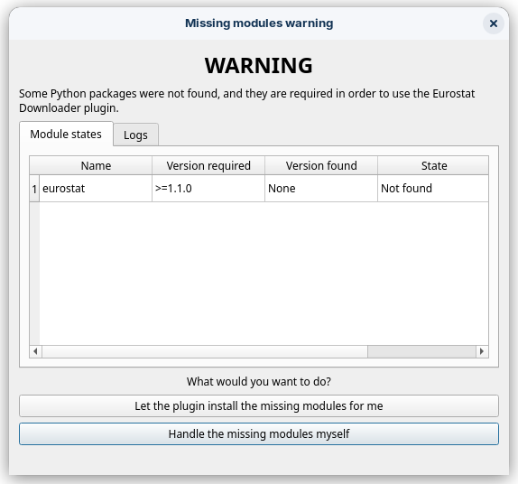
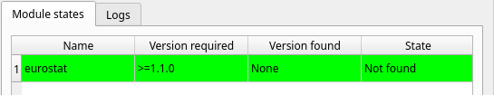
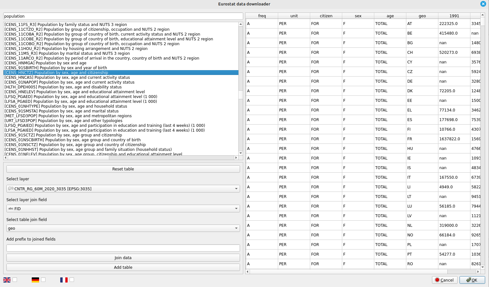
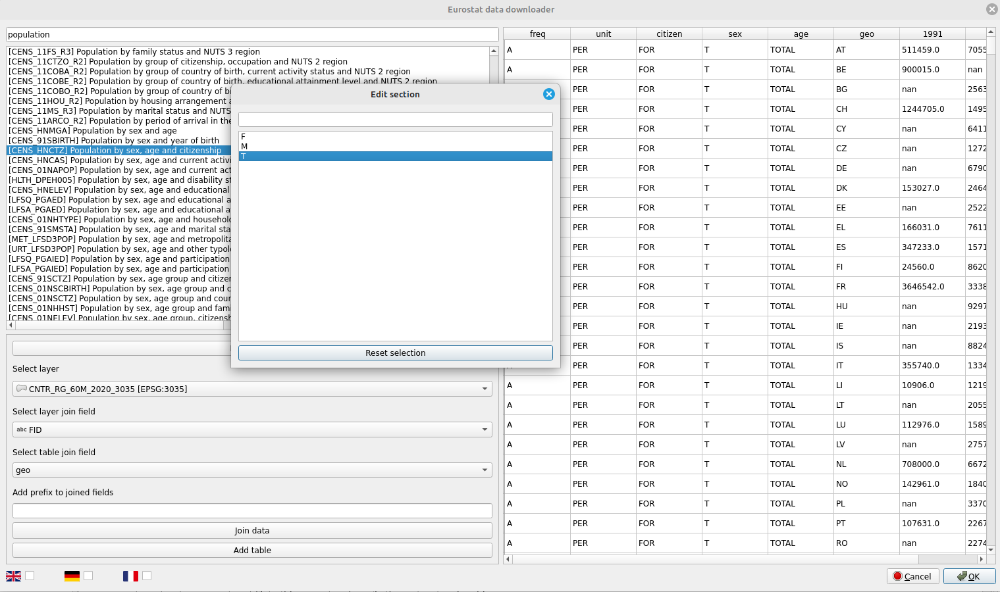
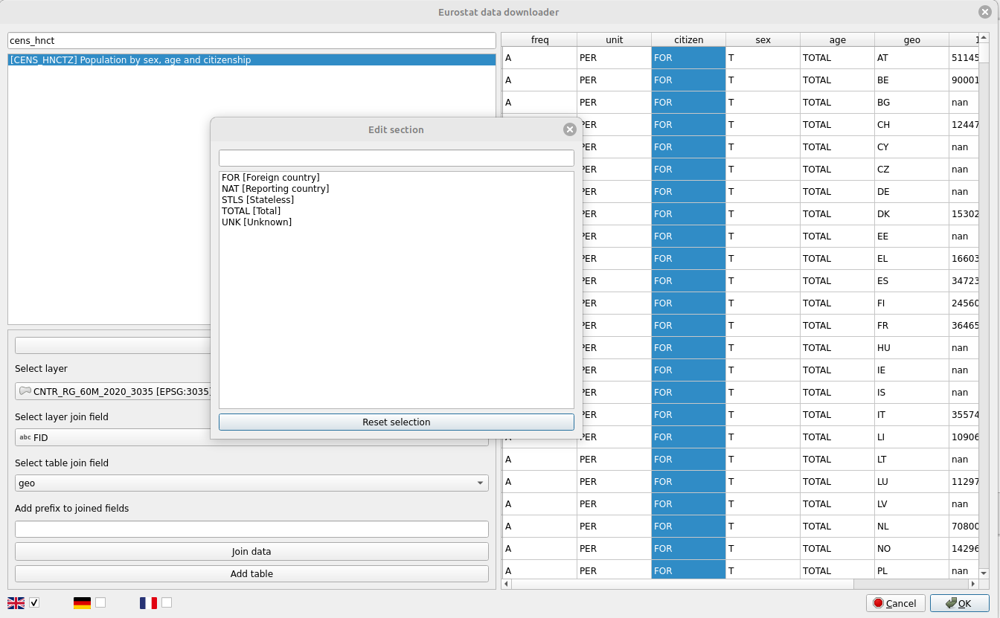
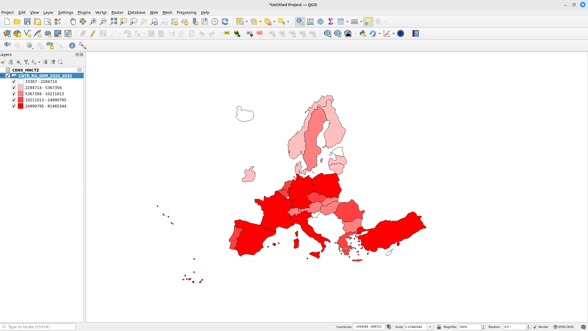

image source: *https://ec.europa.eu/eurostat*

# Eurostat downloader QGIS plugin

It can be used to add Eurostat datasets as tables in QGIS and join them with vector layers.

# Installing external Python dependencies

In order for this plugin to run properly, the [eurostat python package](https://pypi.org/project/eurostat/) needs to be installed. It is available via PyPi.

## Installing dependencies

If the [eurostat python package](https://pypi.org/project/eurostat/) is missing, a dialog will pop up which should assist the inexperienced user.

If you choose to install them this way, they will be installed in the plugin folder. Removing the Eurostat Downloader plugin will also remove the installed packages. This option is only available if pip (https://pypi.org/project/pip/) is available.

If the packages were installed correctly, they will be marked with the color red, like this.

# How to install the plugin

## Option 1: from the QGIS plugin repository

The plugin is available in the [QGIS plugin repository](https://plugins.qgis.org/plugins/eurostat_downloader/). The latest version might be flagged as an experimental plugin, so you will have enable the *Show also experimental* plugins setting by going to *Plugins -> Manage and install plugins -> Settings*. After enabling this setting, you can find the plugin by searching for it in the *All* tab. 

## Option 2: manually, from the releases page

Navigate [here](https://github.com/alecsandrei/eurostat_downloader/releases) and download the zip file associated with the latest release (eurostat_downloader.zip). After that, in QGIS, go to *Plugins -> Manage and Install Plugins -> Install* from zip and select the downloaded zip file.

# How to use the plugin (might be outdated).

[Video tutorial 1](https://www.youtube.com/watch?v=ijo2JOL88Y0)
[Release 0.2.0 updates](https://www.youtube.com/watch?v=5cJnTPmUayI)

## Selecting a dataset from the Eurostat database

Let's start by downloading a vector layer from [here](https://ec.europa.eu/eurostat/web/gisco/geodata/reference-data/administrative-units-statistical-units/countries). I will choose [this](https://gisco-services.ec.europa.eu/distribution/v2/countries/download/ref-countries-2020-60m.shp.zip) one and add it to QGIS.

Open the plugin and type anything in the search bar. The table of contents will be generated. This may take a while, depending on how fast your internet speed is. Search for any dataset that you would like to use. I will choose **CENS_HNCTZ: Population by sex, age and citizenship**. Click on it, and wait for the table to fill.

## Applying filters to the dataset

Now that the table is filled with data, we can apply filters to it. In order to do so, left click on the name of the column. I will select the **T** value (which stands for total) from the 3 available in the sex column.

We can see the table also filtered dynamically as we selected the **T** value. There is a problem though. If we click on the **citizen** column we will see very abstract abbreviations like FOR, NAT, STLS, and UNK. In the previous example it was easy to guess that F, M AND T stand for female, male and total. In this example, we will need some sort of translation to describe what the abbreviation stands for. To do this, close the **Edit section** window and select a language from the bottom left. Now click on the **citizen** column again.

The time range can also be filtered.

## Adding the table and joining the data with a vector layer

Now that we applied the filters, if we just want to export the table for further analysis in Excel, Python or R we can click on the **Add table** button. A temporary table will be created in your QGIS instance and you are free to export the data.

We can also join the data to the vector layer we downloaded earlier. By default, the plugin tries to infer both the column with the geographic codes from the Eurostat dataset and the field from the vector layer that matches the values from that Eurostat dataset column. In my case, the plugin selected FID for the layer join field and geo for the table (Eurostat data) join field by default. Make sure to check if the join fields were correctly selected. Now, we can just join the data by clicking on the **Join data** button. **Be careful!** The joined data is temporary. You will now need to export the vector layer in order to keep the joined data.

# TODOs
- [ ] Integrate [gisco-geodata](https://github.com/alecsandrei/gisco-geodata) into the plugin.

# Disclaimer

This plugin, Eurostat Downloader, is an independent project created by Cuvuliuc Alex-Andrei. It is not an official product of Eurostat, and Cuvuliuc Alex-Andrei is not affiliated, associated, authorized, endorsed by, or in any way officially connected with Eurostat or any of its subsidiaries or its affiliates.
